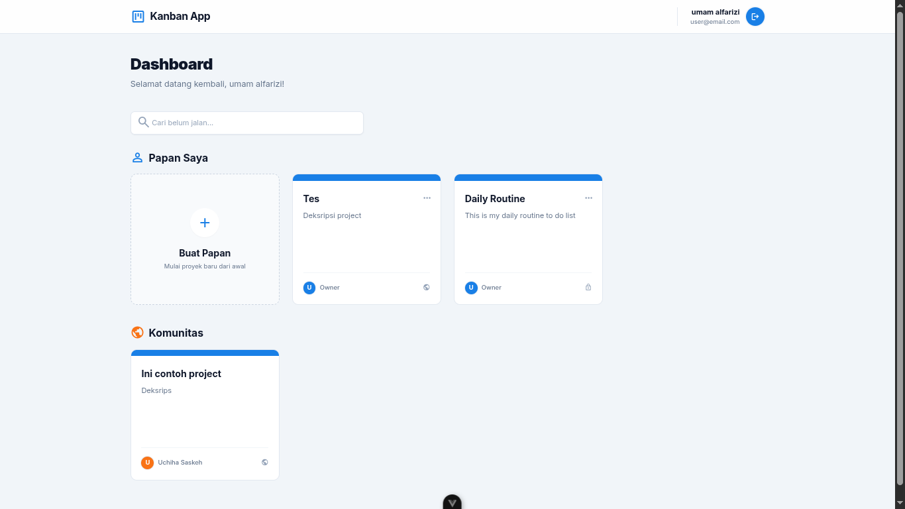
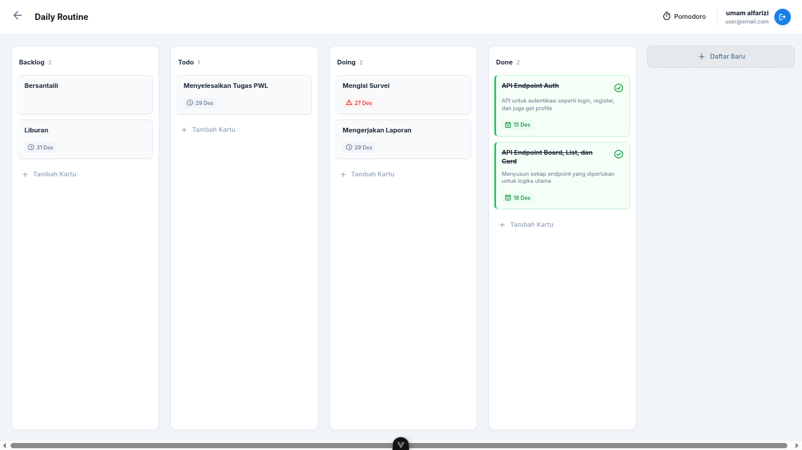
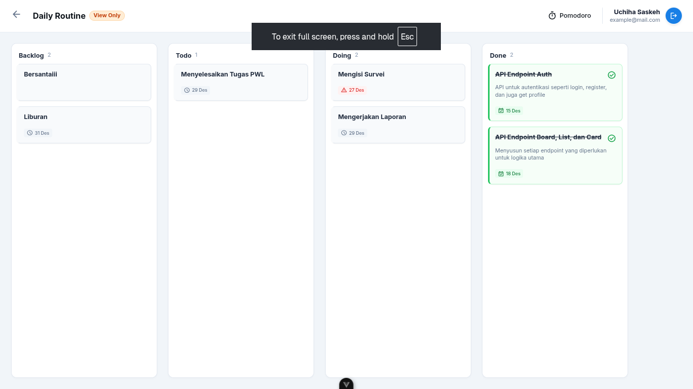

# Kanban App (Full Stack)

Aplikasi manajemen proyek kolaboratif yang mengadopsi metodologi Kanban, dirancang dengan arsitektur Full Stack modern yang memisahkan logika antarmuka pengguna (Frontend) dan pemrosesan data (Backend). Aplikasi ini dibangun menggunakan Vue.js 3 untuk sisi klien dan Express.js untuk sisi server, menawarkan pengalaman pengguna yang responsif dan skalabilitas sistem yang baik.



## Fitur Utama

Aplikasi ini menyediakan serangkaian fitur komprehensif untuk mendukung produktivitas tim dan manajemen tugas yang efisien.

### Manajemen Proyek (Kanban)
Inti dari aplikasi ini adalah sistem papan kerja digital yang fleksibel. Pengguna dapat membuat **Board** tanpa batas, baik yang bersifat pribadi maupun publik. Setiap papan terdiri dari **List** yang berfungsi sebagai kolom status (seperti "To Do", "In Progress", "Done"), di mana daftar ini dapat disusun ulang posisinya sesuai alur kerja yang diinginkan. Unit terkecil dari tugas direpresentasikan sebagai **Card** yang memuat detail penting seperti judul, deskripsi lengkap, tenggat waktu (due date), dan penanda status penyelesaian. Interaksi antar elemen dibangun agar intuitif, memungkinkan pengguna memindahkan kartu antar daftar maupun mengubah urutan daftar itu sendiri.



### Project Komunitas
Aplikasi menyediakan fitur **Public Boards**. Pengguna dapat menjelajadi papan proyek milik pengguna lain yang telah diatur sebagai publik, namun sebatas melihat. Identitas kepemilikan papan dijaga melalui **Owner Badges**, sehingga pengguna dapat dengan mudah mengenali pembuat asli dari sebuah papan proyek.



### Produktivitas Terintegrasi
Selain manajemen tugas dasar, aplikasi ini dilengkapi dengan fitur pendukung produktivitas. **Pomodoro Timer** terintegrasi memungkinkan pengguna menerapkan teknik manajemen waktu fokus-istirahat tanpa perlu meninggalkan aplikasi. Untuk menciptakan suasana kerja yang kondusif, tersedia juga fitur **Lofi Audio Player** yang memutar musik latar yang menenangkan untuk meningkatkan konsentrasi.


## Teknologi yang Digunakan

Pengembangan aplikasi ini memanfaatkan teknologi terkini dalam ekosistem JavaScript.

### Frontend (Sisi Klien)
Terletak pada direktori `/frontend`, antarmuka pengguna dibangun menggunakan **Vue.js 3** dengan Composition API yang modern. Proses build dan pengembangan didukung oleh **Vite** untuk performa yang cepat. Desain antarmuka dibuat responsif dan estetis menggunakan kerangka kerja CSS **Tailwind CSS**. Navigasi antar halaman dikelola oleh **Vue Router 4**, sementara komunikasi data dengan server ditangani menggunakan **Axios**.

### Backend (Sisi Server)
Terletak pada direktori `/backend`, logika bisnis aplikasi dijalankan di atas **Node.js** dengan kerangka kerja **Express.js**. Penyimpanan data menggunakan basis data relasional **MySQL**, yang diakses dan dikelola melalui ORM **Sequelize** untuk keamanan dan kemudahan manipulasi data. Sistem autentikasi pengguna diimplementasikan secara aman menggunakan standar **JSON Web Token (JWT)**.

## Panduan Instalasi dan Menjalankan

Untuk menjalankan aplikasi ini di lingkungan lokal Anda, pastikan telah terinstal **Node.js** (versi 18+ disarankan), **MySQL Server**, dan **NPM**. Aplikasi terdiri dari dua bagian yang harus dijalankan secara bersamaan.

### Konfigurasi Backend

Masuk ke direktori `backend` dan instal seluruh dependensi yang diperlukan dengan perintah `npm install`. Sebelum menjalankan server, Anda perlu mengatur variabel lingkungan. Salin berkas `.env.example` menjadi `.env` dan sesuaikan kredensial basis data Anda (host, user, password, dan nama database).

Setelah konfigurasi selesai, buat basis data kosong di MySQL sesuai nama yang Anda tentukan. Jalankan perintah migrasi `npm run migrate` untuk membuat struktur tabel secara otomatis. Terakhir, jalankan server mode pengembangan dengan perintah `npm run dev`. Server backend akan aktif, biasanya pada port 3000.

### Konfigurasi Frontend

Buka terminal baru dan masuk ke direktori `frontend`. Instal dependensi dengan perintah `npm install`. Jalankan server pengembangan frontend menggunakan perintah `npm run dev`. Aplikasi akan dapat diakses melalui peramban web pada alamat lokal yang ditampilkan (umumnya `http://localhost:5173`).

## Struktur Proyek

Susunan kode sumber diorganisir untuk memisahkan tanggung jawab dengan jelas.

```
kanban-app/
├── backend/                # Logika Sisi Server
│   ├── src/
│   │   ├── config/         # Konfigurasi database & env
│   │   ├── controllers/    # Pengendali logika bisnis
│   │   ├── middleware/     # Autentikasi & error handling
│   │   ├── models/         # Skema & relasi database
│   │   ├── routes/         # Definisi endpoint API
│   │   └── validations/    # Validasi input request
│   └── ...
├── frontend/               # Antarmuka Pengguna
│   ├── src/
│   │   ├── assets/         # Gambar & style global
│   │   ├── components/     # Elemen UI reusable (Card, Modal)
│   │   ├── composables/    # Logic reuse (Auth, Board)
│   │   ├── router/         # Konfigurasi rute halaman
│   │   ├── services/       # Komunikasi API (Axios)
│   │   └── views/          # Halaman utama aplikasi
│   └── ...
├── screenshots/            # Aset gambar dokumentasi
└── README.md               # Dokumentasi Proyek
```

## Galeri Aplikasi

Berikut adalah beberapa tangkapan layar antarmuka aplikasi:

**Autentikasi Pengguna**

*Halaman Login*


*Halaman Registrasi*

**Manajemen Board & List**

*Menambahkan daftar baru*


*Mengubah detail daftar*


*Konfirmasi penghapusan daftar*

**Manajemen Kartu Tugas**

*Menambahkan kartu tugas baru*


*Melihat detail kartu*


*Mengubah informasi kartu*


*Menu opsi pada kartu*


---

Kelompok 10:

1. Nurul Qalbi Zahrani
2. Umam Alparizi
3. M. bayu Aji
